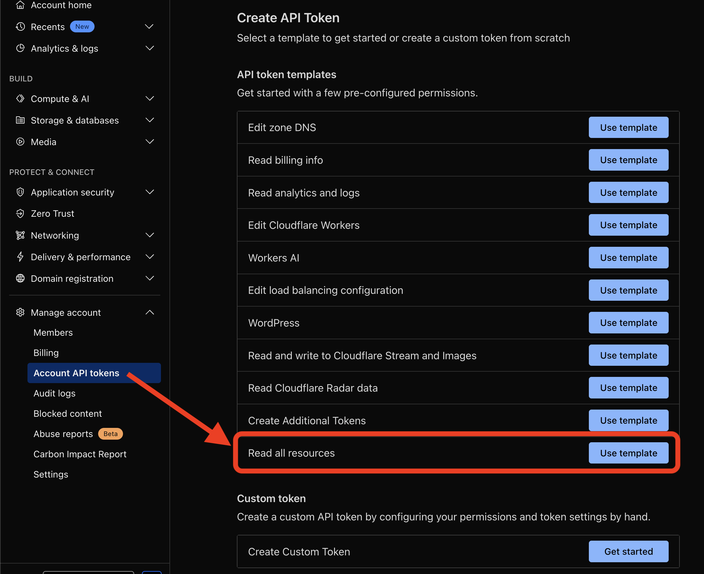

# cftelescope

A CLI tool for inspecting and managing Cloudflare accounts and zones.
Built with the official Cloudflare Go SDK v6, cftelescope provides a comprehensive command-line interface to interact with Cloudflare's extensive API.

## Features

- **Account Management**: List accounts, view account profiles, audit logs, and more
- **Zone Management**: List zones, view zone details, DNS records, SSL certificates, and configurations
- **Extensive Service Coverage**: Support for 700+ Cloudflare API endpoints including:
  - Workers, Pages, and Durable Objects
  - D1 Databases
  - Images and Stream
  - Cache and CDN settings
  - SSL/TLS certificates
  - DNS records and DNSSEC
  - Load Balancers
  - Rulesets and security features
  - Logs and Analytics
  - Argo and Speed optimizations
  - And many more...

## Prerequisites

- Go 1.24.2 or later
- Cloudflare account with API token
- Cloudflare Account ID

## Installation

### From Source

```bash
# Clone the repository
git clone <repository-url>
cd cftelescope

# Build the binary
go build -o cftelescope

# (Optional) Install globally
go install
```

## Configuration

cftelescope requires Cloudflare API credentials to function. You must create a `.env` file in the same directory as the binary.

### Create .env file

1. Copy the example file:

```bash
cp .env.example .env
```

2. Edit `.env` and add your credentials:

```env
CLOUDFLARE_ACCOUNT_ID=your_account_id_here
CLOUDFLARE_API_TOKEN=your_api_token_here
```

### Getting Your Credentials

- **Account ID**: Found in your Cloudflare dashboard URL or on the overview page
- **API Token**: Create one at https://dash.cloudflare.com/profile/api-tokens

  - Recommended: Use a token with appropriate read permissions for the resources you want to inspect

- **Required Permissions**:
  

## Usage

### Basic Commands

```bash
# Show help
./cftelescope --help

# List all available commands
./cftelescope [command] --help
```

### Account Commands

```bash
# List all accounts
./cftelescope account list

# Get account profile
./cftelescope account accounts-accountprofile-get

# View alerting history
./cftelescope account alerting-history-list

# List Workers
./cftelescope account workers list

# List Pages projects
./cftelescope account pages list

# List D1 databases
./cftelescope account d1 database-list

# List Images
./cftelescope account images v1-list

# View Stream videos
./cftelescope account stream list

# Intel operations
./cftelescope account intel [subcommand]

# RUM (Real User Monitoring)
./cftelescope account rums siteinfo-list

# Calls (WebRTC)
./cftelescope account calls [subcommand]
```

### Zone Commands

```bash
# List all zones
./cftelescope zone list

# Get zone details (requires zone ID)
./cftelescope zone info -z <zone-id>

# List DNS records
./cftelescope zone dns-list -z <zone-id>

# Get DNSSEC status
./cftelescope zone dns-dnssec-get -z <zone-id>

# SSL certificate information
./cftelescope zone ssl [subcommand] -z <zone-id>

# Cache settings
./cftelescope zone cache [subcommand] -z <zone-id>

# Rulesets (WAF, Page Rules, etc.)
./cftelescope zone rulesets [subcommand] -z <zone-id>

# Argo Smart Routing
./cftelescope zone argo [subcommand] -z <zone-id>

# Speed optimizations
./cftelescope zone speed [subcommand] -z <zone-id>

# Load Balancers
./cftelescope zone lb-list -z <zone-id>

# Logpush jobs
./cftelescope zone logpush [subcommand] -z <zone-id>

# Logs
./cftelescope zone logs [subcommand] -z <zone-id>

# Snippets
./cftelescope zone snippets [subcommand] -z <zone-id>

# Zaraz (Tag Management)
./cftelescope zone zaraz [subcommand] -z <zone-id>
```

### Specifying Zone ID

Many zone commands require a zone ID. You can provide it in two ways:

1. **Via flag**:

```bash
./cftelescope zone info -z <zone-id>
```

2. **Via environment variable** in `.env`:

```env
CLOUDFLARE_ZONE_ID=your_zone_id_here
```

## Project Structure

```
cftelescope/
├── cmd/                    # Command implementations
│   ├── account/           # Account-specific commands
│   │   ├── calls/         # Calls (WebRTC) commands
│   │   ├── d1/            # D1 database commands
│   │   ├── images/        # Images commands
│   │   ├── intel/         # Intelligence commands
│   │   ├── pages/         # Pages commands
│   │   ├── rums/          # RUM commands
│   │   ├── stream/        # Stream commands
│   │   └── workers/       # Workers commands
│   ├── zone/              # Zone-specific commands
│   │   ├── argo/          # Argo Smart Routing
│   │   ├── cache/         # Cache settings
│   │   ├── logpush/       # Logpush jobs
│   │   ├── logs/          # Log access
│   │   ├── ruleset/       # Rulesets and rules
│   │   ├── snippets/      # Snippets
│   │   ├── speed/         # Speed optimizations
│   │   ├── ssl/           # SSL/TLS
│   │   └── zaraz/         # Zaraz tag management
│   ├── account.go         # Account command group
│   ├── zone.go            # Zone command group
│   └── rootCmd.go         # Root command setup
├── main.go                # Application entry point
├── go.mod                 # Go module definition
├── .env.example           # Example environment file
└── command_list.txt       # List of supported API methods
```

## Dependencies

- **[cloudflare-go](https://github.com/cloudflare/cloudflare-go)** v6.1.0 - Official Cloudflare Go SDK
- **[cobra](https://github.com/spf13/cobra)** v1.10.1 - CLI framework
- **[viper](https://github.com/spf13/viper)** v1.21.0 - Configuration management

## Development

### Building

```bash
go build -o cftelescope
```

### Testing

```bash
go test ./...
```

### Adding New Commands

The project uses Cobra for command structure. To add new commands:

1. Create a new file in the appropriate directory (`cmd/account/` or `cmd/zone/`)
2. Define your command using Cobra's command structure
3. Register the command in the parent command's `init()` function

Example command structure:

```go
var myNewCmd = &cobra.Command{
    Use:   "my-command",
    Short: "Short description",
    Long:  `Long description`,
    Run: func(cmd *cobra.Command, args []string) {
        // Implementation
    },
}
```

## Contributing

Contributions are welcome! Please feel free to submit issues or pull requests.

## License

MIT License

## Author

jongsik <jongsik@cloudflare.com>
